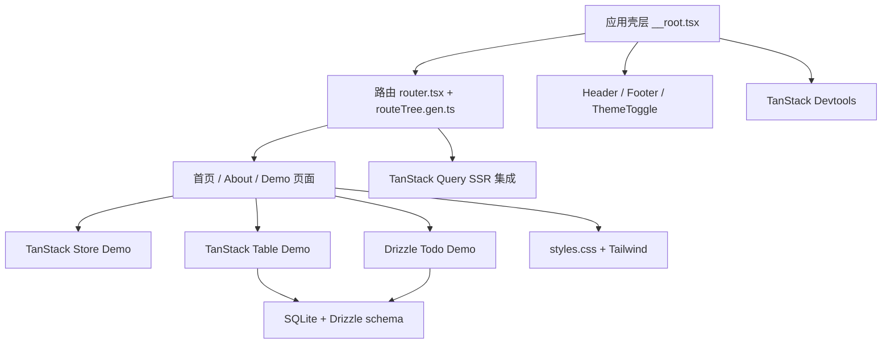

# vibe-coding-test 模块开发文档

本文档目录按项目模块拆分，面向后续开发、AI 协作和代码 Review 使用。

## 项目定位

`vibe-coding-test` 是一个 TanStack Start 示例项目，技术栈包括：

- React 19
- Vite 8
- TanStack Start / Router / Query / Store / Table
- Tailwind CSS 4
- Drizzle ORM + better-sqlite3
- Biome

项目当前更像“功能样板 + 技术验证场”，包含基础页面、全局壳层、主题切换、TanStack 系列 demo、SQLite Todo demo、SQLite 表格 demo 和工程配置。

## 模块清单

| 模块 | 文档 | 主要职责 |
| --- | --- | --- |
| 应用壳层 | [app-shell.md](./app-shell.md) | 根 HTML、全局样式、Header/Footer、Devtools、路由上下文 |
| 路由与页面 | [routing-pages.md](./routing-pages.md) | 文件路由、页面入口、生成路由树、Loader 使用方式 |
| UI 组件 | [ui-components.md](./ui-components.md) | Header、Footer、ThemeToggle、导航与主题交互 |
| 样式与主题 | [styling-theme.md](./styling-theme.md) | Tailwind、CSS 变量、深浅色主题、共享视觉类 |
| TanStack Query | [tanstack-query.md](./tanstack-query.md) | QueryClient、SSR Query 集成、Query Devtools、查询 demo |
| TanStack Store | [demo-store.md](./demo-store.md) | 全局 store、派生状态、Store Devtools、表单联动 |
| TanStack Table | [demo-table.md](./demo-table.md) | SQLite 表格数据、server function、模糊过滤、排序、分页 |
| Drizzle 数据库 | [database-drizzle.md](./database-drizzle.md) | SQLite 连接、schema、server function、Todo 和表格 demo |
| 环境与工程化 | [environment-tooling.md](./environment-tooling.md) | Vite、TypeScript、Biome、shadcn、环境变量、脚本 |

## 模块关系



## 开发总原则

- 优先沿用现有目录：页面放 `src/routes`，共享组件放 `src/components`，共享逻辑放 `src/lib`。
- 不手动编辑 `src/routeTree.gen.ts`，需要通过 TanStack Router 生成流程更新。
- 新增路由后确认 Header 是否需要加入导航入口。
- 修改数据库 schema 后运行 Drizzle 生成/迁移命令，并验证 demo 页面。
- 修改主题、全局类名或布局时同时检查浅色、深色和移动端。
- 完成前至少运行与改动相关的验证命令；没有验证证据不要声称完成。

## 文档维护规则

模块文档只维护“当前事实”，不要写历史流水账。

- 当前模块如何工作、如何扩展、如何验证：写入对应 `modules/*.md`。
- 有意义的历史变更、原因和验证结果：新增 [changes](../changes/README.md) 日志碎片。
- 重要技术取舍、放弃方案和回看条件：新增 [decisions](../decisions/README.md) ADR 文件。
- 变更记录可复制 [change-record.md](../templates/change-record.md) 模板。

需要同步模块文档的变更包括：模块职责、路由、API、状态、数据库 schema、配置、运行方式、测试方式。普通 typo、格式化、局部变量名调整不需要更新模块文档。

## 常用命令

```bash
npm run dev
npm run build
npm run test
npm run check
npm run db:generate
npm run db:migrate
npm run db:studio
```
